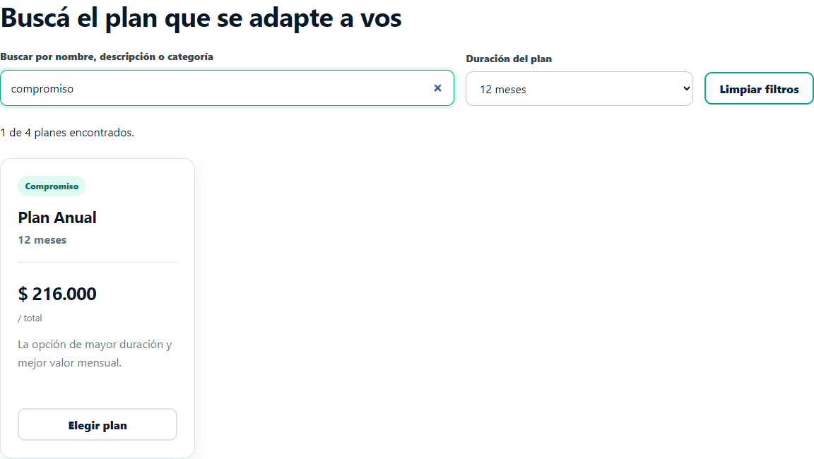
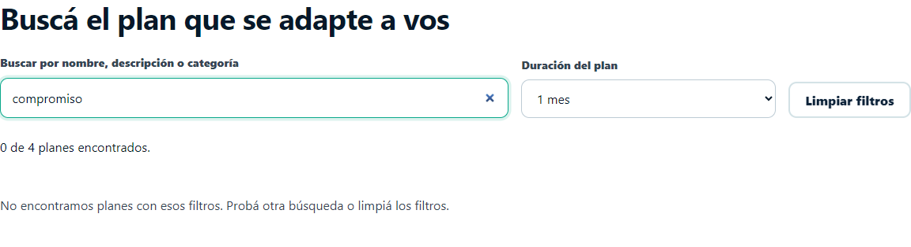

# Gym Control

Buscador y filtro de catálogo en tiempo real

**Actividad** Startup Relámpago
**Tarjeta** Opción 3
**Metodología** SOHDM
**Carrera** Ingeniería en Sistemas de Información
**Materia** Paradigmas y Lenguajes de Programación III
**Comisión** A
**Profesor** Sicardi Dante
**Integrantes del proyecto** Martins Santino, Olexyn Franco y Tarnoski Santiago
**Fecha** 26 de septiembre de 2026

## 1 Propósito y alcance

Se incorpora un buscador y un filtro por duración al catálogo de planes de Gym Control. El usuario explora los cuatro planes del TP1 y reduce los resultados mientras escribe. La carga del catálogo se realiza por HTTP y el filtrado posterior se ejecuta en memoria, sin recargar la página.

El módulo enriquecido es listado_box.html. Se mantienen la temática del gimnasio, las cinco páginas, los precios de ejemplo y el diseño existente. Los archivos subtotal.js y cupon.js conservan las funciones desarrolladas previamente. El nuevo aporte corresponde a exploración y búsqueda, y se fundamenta mediante SOHDM.

## 2 Cumplimiento de la consigna

| Requisito | Implementación |
| --- | --- |
| Tema del TP1 | Catálogo de planes de membresía de Gym Control. |
| Eventos desacoplados | input, change y click con addEventListener en js/app.js. |
| Carga HTTP asíncrona | fetch y async/await consultan data/planes.json. |
| Catálogo completo | Los cuatro registros se cargan antes de buscar. |
| Filtro en memoria | Array.filter combina texto y duración. |
| Resultados dinámicos | Tarjetas, contador y mensajes actualizan el DOM. |
| Metodología de Unidad 1 | Escenario de búsqueda y mapa navegacional SOHDM. |

## 3 Estructura de datos y responsabilidades

La página HTML contiene controles de búsqueda y un contenedor de resultados. data/planes.json aporta el catálogo y js/app.js realiza la carga, validación, filtrado y construcción de tarjetas. El CSS original se complementa con una barra de filtros adaptable a pantallas pequeñas.

| Campo de un plan | Uso |
| --- | --- |
| id | Identificador para conservar la selección al abrir el formulario. |
| nombre | Título del plan y campo de búsqueda. |
| duracionMeses | Filtro de 1, 3, 6 o 12 meses. |
| precio | Importe total del plan, expresado en ARS. |
| categoria | Etiqueta de la tarjeta y campo de búsqueda. |
| descripcion | Información del servicio y campo de búsqueda. |
| destacado | Marca visual del Plan Semestral recomendado. |

## 4 Carga y filtrado con JavaScript

cargarCatalogo() solicita el JSON con fetch, verifica response.ok y espera la lectura con respuesta.json(). validarCatalogo() exige un array y verifica identificadores, textos, duración, precio y la marca de destacado. try/catch informa errores de red, HTTP, lectura o estructura [2].

```js
const respuesta = await fetch("data/planes.json",
  { cache: "no-store" });
if (!respuesta.ok) {
  throw new Error(`Error HTTP ${respuesta.status}`);
}
catalogo = validarCatalogo(await respuesta.json());
```

El texto se normaliza con trim(), minúsculas y descomposición Unicode para ignorar tildes. filtrarPlanes() exige que coincidan ambos criterios. Una búsqueda vacía y la opción Todas las duraciones muestran el catálogo completo.

```js
const resultados = catalogo.filter(plan => {
  const contenido = normalizar(
    `${plan.nombre} ${plan.descripcion} ${plan.categoria}`
  );
  return contenido.includes(termino) &&
    (duracion.value === "" || plan.duracionMeses === meses);
});
```

crearTarjeta() construye nodos con createElement y textContent. Los resultados se agrupan en un DocumentFragment y se presentan con replaceChildren. La entrada se trata como texto, sin interpretarla como HTML. No se necesita otro fetch al cambiar un filtro [3].

## 5 Escenario de exploración y búsqueda

**Escenario E01.** Un usuario interesado quiere encontrar un plan adecuado entre las opciones del gimnasio. El actor es un visitante o socio que consulta el catálogo. La precondición es que el sitio esté servido mediante HTTP y pueda acceder a data/planes.json.

**Flujo principal.** El usuario entra al catálogo desde Inicio o el listado en tabla. El sistema carga los planes y muestra las tarjetas. El usuario escribe un término, selecciona una duración o combina ambas acciones. El sistema filtra los registros y presenta resultados y contador. El usuario elige un plan y llega al formulario con esa opción marcada.

| Paso | Acción del usuario | Respuesta del sistema |
| --- | --- | --- |
| 1 | Abrir Planes en cards | Carga HTTP y cuatro tarjetas. |
| 2 | Escribir progreso | Filtra por categoría y muestra el Plan Semestral. |
| 3 | Seleccionar 6 meses | Mantiene el resultado compatible. |
| 4 | Elegir ese plan | Navega a comprar.html?plan=semestral. |
| 5 | Consultar el formulario | Marca el plan y activa el subtotal existente. |

**Alternativas.** Si no hay coincidencias, la página muestra un mensaje y permite corregir o limpiar los filtros. Si el catálogo está vacío, informa que no hay planes disponibles. Si falla la carga, bloquea los controles y permite reintentar. Estas situaciones se distinguen para evitar interpretar una falla de red como una búsqueda sin coincidencias.

Figura 1 Actividades del escenario E01 y retorno para refinar la búsqueda

**Postcondición.** El usuario obtiene un conjunto de planes que cumplen los criterios, o llega al formulario con un plan identificado. No se registra una compra ni una membresía; la actividad amplía la consulta previa a la selección.

## 6 Fundamentación mediante SOHDM

SOHDM significa Scenario Based Object Oriented Hypermedia Design Methodology. Lee, Lee y Yoo plantean una metodología que parte de escenarios para identificar requisitos y utiliza vistas de objetos para diseñar la navegación. Sus seis fases son análisis del dominio, modelado de objetos, diseño de vistas, diseño de navegación, diseño de implementación y construcción [1].

En Gym Control, el escenario E01 determina qué información necesita el visitante y qué recorridos deben existir. La búsqueda exige los campos del plan; la comparación requiere una vista de resultados; la elección demanda un enlace que conserve el identificador. La estructura del sitio se justifica mediante esas actividades.

| Fase | Aplicación al módulo |
| --- | --- |
| Análisis del dominio | Escenario E01, actor, flujo principal y alternativas. |
| Modelado de objetos | Plan, Consulta y Catálogo con responsabilidades de búsqueda. |
| Diseño de vistas | Controles, resultado resumido y mensaje de estado. |
| Diseño de navegación | Inicio, catálogo, detalle mensual y formulario de selección. |
| Diseño de implementación | JSON, eventos, funciones, estructuras HTML y estilos. |
| Construcción | Código integrado y pruebas de interacción por HTTP. |

## 7 Objetos y colaboración

| Objeto conceptual | Responsabilidad | Colabora con |
| --- | --- | --- |
| Plan | Describe una opción mediante nombre, precio, duración y beneficios. | Catálogo y tarjeta de resultado. |
| Consulta | Representa texto normalizado y duración solicitada. | Controles y función de filtrado. |
| Catálogo | Contiene los planes y obtiene las coincidencias. | Carga HTTP, Consulta y vista de resultados. |

Los objetos se representan mediante registros JSON, variables y funciones JavaScript. No es necesario declarar clases con class para documentar sus responsabilidades. La consulta proviene de buscar-plan y filtrar-duracion; el catálogo se mantiene en memoria y conserva los registros originales al aplicar .filter().

Las vistas son proyecciones orientadas a la tarea: la barra permite expresar criterios; cada tarjeta muestra un plan resumido; el contador informa el tamaño de la selección. Los mensajes de vacío y error ayudan al usuario a decidir cómo continuar. El resultado del filtrado es un estado del catálogo, no una página nueva.

## 8 Mapa navegacional del módulo

El mapa conserva los nodos del TP1 y añade búsqueda y resultados como estados internos de listado_box.html. La navegación principal conecta Inicio con ambas formas de listado. Desde un resultado se accede a comprar.html conservando el ID del plan; la ficha producto.html continúa representando específicamente el Plan Mensual.

Figura 2 Mapa de páginas y accesos del escenario de búsqueda de Gym Control

El recorrido principal es Inicio → Catálogo → Consulta → Resultados → Selección. El usuario puede volver a definir la consulta sin abandonar el catálogo. Si la carga falla, Reintentar vuelve a ejecutar la consulta HTTP sobre el mismo nodo; si no hay coincidencias, Limpiar filtros recupera los cuatro registros.

## 9 Eventos y actualización de la interfaz

| Elemento | Evento | Resultado |
| --- | --- | --- |
| buscar-plan | input | Filtra con cada cambio del texto. |
| filtrar-duracion | change | Aplica la duración elegida. |
| limpiar-filtros | click | Borra criterios y devuelve el foco. |
| reintentar-catalogo | click | Repite la carga HTTP tras un error. |

Los eventos se registran en app.js con addEventListener [4]. El HTML utiliza IDs y atributos semánticos sin onclick ni onsubmit. role="status" y aria-live="polite" comunican los resultados; aria-busy señala la carga. Mientras no hay datos válidos, los filtros permanecen deshabilitados. En móviles, los controles y tarjetas se reorganizan en una columna.

Mapa editable: [mapa-navegacional-tarjeta3.mmd](mapa-navegacional-tarjeta3.mmd)

## 10 Pruebas y evidencias

Se ejecutaron 36 comprobaciones en Google Chrome sobre un servidor HTTP local. Todas finalizaron correctamente. tests/catalogo.cjs permite repetirlas y docs/pruebas-tarjeta3.json conserva el registro. Los casos de error se provocaron interceptando las respuestas del JSON en el navegador de prueba.

| Grupo | Resultado comprobado |
| --- | --- |
| Carga | Una petición al JSON y cuatro tarjetas iniciales. |
| Búsqueda | Nombre, descripción y categoría; mayúsculas, espacios y tildes. |
| Duración | Opciones de 1, 3, 6 y 12 meses; combinación con texto. |
| Resultados | Contador, cero coincidencias, limpieza y foco; sin nuevas peticiones. |
| Integración | Plan preseleccionado y subtotal y cupón originales operativos. |
| Errores | 404, red, JSON malformado, esquema, precio e ID duplicado. |
| Presentación | Vista móvil de 390 px sin desbordamiento y textos sin HTML ejecutable. |

Figura 3 Búsqueda compromiso y duración de 12 meses con un resultado



Figura 4 Mismo texto con duración incompatible y mensaje sin resultados



Las capturas completas, la vista móvil y el error HTTP se conservan en docs/capturas-tarjeta3. Las capturas originales del cupón permanecen en docs/capturas.

## 11 Ejecución y demostración

La nueva carga usa HTTP. Con Python instalado, ejecutar iniciar.bat o abrir una terminal en la raíz del proyecto y utilizar:

```sh
py -m http.server 8000 --bind 127.0.0.1
```

Si la instalación usa python, reemplazar py por python. Abrir http://localhost:8000/index.html, entrar en Planes en cards y mantener el servidor activo durante la demostración. Live Server en Visual Studio Code es otra alternativa si está instalado.

**Demostración sugerida.** Buscar renovacion para comprobar la coincidencia con renovación. Limpiar y buscar progreso con duración 6 meses. Cambiar a 1 mes para obtener cero resultados. Limpiar y elegir el Plan Trimestral: el formulario lo preselecciona y muestra $67.500. El subtotal anterior debe pasar a $135.000 al ingresar dos membresías.

Para repetir las pruebas automáticas se requiere Node.js y Google Chrome. npm install instala la dependencia de pruebas y npm test ejecuta el recorrido. El sitio no necesita una biblioteca JavaScript de producción ni un servidor de aplicación.

## 12 Conclusión y límites

La tarjeta 3 se completa con eventos desacoplados, carga asíncrona del catálogo mediante fetch, filtrado con .filter() e incorporación dinámica de resultados al DOM. SOHDM fundamenta el escenario E01 y el mapa de accesos que conecta la exploración con la selección del plan.

Los planes y precios son datos de ejemplo del TP1. El JSON funciona como recurso servido por HTTP y no como una base de datos con escritura. No se incorpora autenticación, compra o persistencia. La nueva selección utiliza las funciones anteriores del formulario y mantiene su alcance demostrativo.

## 13 Fuentes

[1] **Lee H Lee C y Yoo C 1999.** A scenario based object oriented hypermedia design methodology. Information and Management 36, 121 a 138. DOI 10.1016/S0378-7206(99)00011-7. [Consultar fuente](https://doi.org/10.1016/S0378-7206(99)00011-7).

[2] **MDN Web Docs.** Using the Fetch API. [Consultar fuente](https://developer.mozilla.org/en-US/docs/Web/API/Fetch_API/Using_Fetch).

[3] **MDN Web Docs.** Array prototype filter. [Consultar fuente](https://developer.mozilla.org/en-US/docs/Web/JavaScript/Reference/Global_Objects/Array/filter).

[4] **MDN Web Docs.** EventTarget addEventListener. [Consultar fuente](https://developer.mozilla.org/es/docs/Web/API/EventTarget/addEventListener).

[5] **Repositorio del TP1.** Gym Control y documentación AE1. Base c7efbe16ab16bf7286a85795768782f3ec989a61. [Consultar fuente](https://github.com/santiagotarnoski/gym-control-ae1).

Fuentes consultadas el 26 de septiembre de 2026. Consigna Startup Relámpago proporcionada para la actividad.
